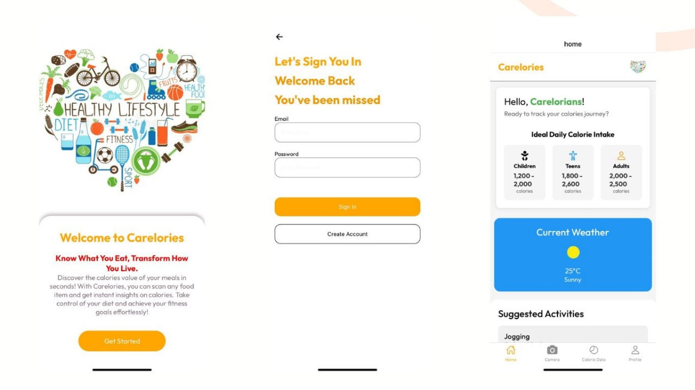
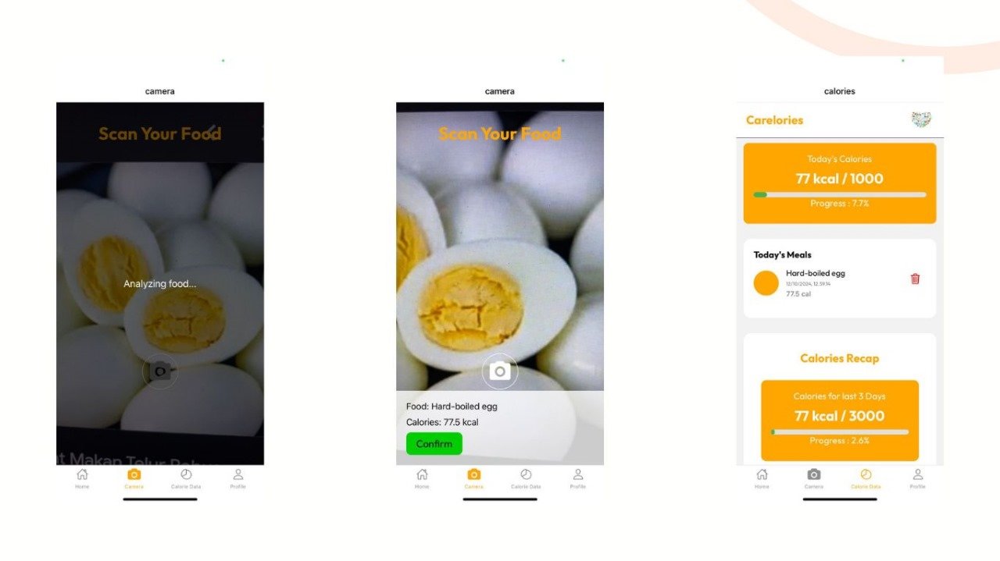

# 🍎 Carelories Mobile App

Selamat datang di repositori **Carelories Mobile App**! 🎉  
Aplikasi ini dirancang untuk membantu pengguna mendeteksi jumlah kalori dalam makanan mereka melalui fitur *food scan* berbasis *deep learning* menggunakan metode CNN. Selain itu, aplikasi ini juga memungkinkan pengguna untuk menetapkan target kalori harian mereka demi mencapai pola makan yang lebih sehat. Aplikasi ini dibangun menggunakan **React Native (Expo)**, **Firebase**, dan **Python** untuk mendukung pengalaman pengguna yang interaktif dan akurat.

## 🚀 Teknologi yang Digunakan

- **React Native (Expo)**: Framework untuk membangun aplikasi mobile yang cepat, lintas platform, dan responsif.
- **Firebase**: Backend *as-a-service* untuk autentikasi pengguna, penyimpanan data, dan analitik aplikasi.
- **Python**: Bahasa pemrograman yang digunakan untuk mengimplementasikan model *deep learning* dengan metode CNN.
- **TensorFlow/PyTorch**: *Framework* *deep learning* untuk melatih dan menjalankan model deteksi kalori makanan.

## ✨ Fitur Utama

### 🎯 Fitur Pengguna
- **Food Scan**: Deteksi jumlah kalori dalam makanan menggunakan kamera dan model CNN.
- **Target Kalori Harian**: Tetapkan target kalori sesuai kebutuhan tubuh dan pantau pencapaiannya.
- **Riwayat Kalori**: Lihat log makanan dan kalori yang telah dikonsumsi.
- **Profil Nutrisi**: Informasi lengkap tentang gizi dari makanan yang discan.

### 🔒 Sistem Autentikasi
- Login dan registrasi yang aman menggunakan **Firebase Authentication**.
- Mendukung login dengan email/password dan metode lainnya.

### 📊 Pelacakan Progres
- Statistik konsumsi kalori harian, mingguan, dan bulanan.
- Pengingat dan notifikasi untuk membantu pengguna tetap pada jalur diet yang sehat.

## 📸 Dokumentasi Tampilan Aplikasi

| Halaman Utama | Food Scan |
| ------------- | --------- |
|  |  |

## 🛠️ Fitur yang Akan Datang

- **Fitur Resep Sehat**: Saran resep makanan berdasarkan kebutuhan kalori pengguna.
- **Integrasi Smartwatch**: Sinkronisasi data dengan perangkat wearable untuk pelacakan yang lebih akurat.
- **Forum Diskusi**: Tempat untuk berbagi tips dan motivasi di antara pengguna.

## 🤝 Kontribusi

Kami terbuka untuk kontribusi!  
Jika Anda ingin berkontribusi, silakan fork repositori ini, buat branch baru, dan buat pull request.  
Kontribusi Anda akan kami tinjau secepat mungkin.

## 📄 Lisensi

Proyek ini dilisensikan di bawah [MIT License](./LICENSE).

## 📞 Kontak

Jika Anda memiliki pertanyaan atau masukan mengenai proyek ini, silakan hubungi kami di:

Instagram: @m.raihanathalah  
Email: rehan121203@gmail.com  

---

Terima kasih telah mengunjungi proyek ini! Kami berharap **Carelories Mobile App** dapat membantu Anda mencapai pola makan yang lebih sehat dan seimbang. 🚀
